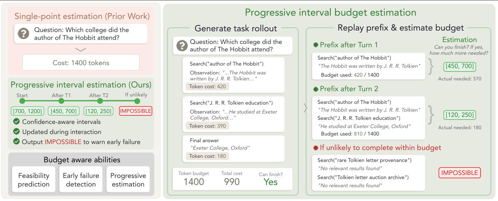
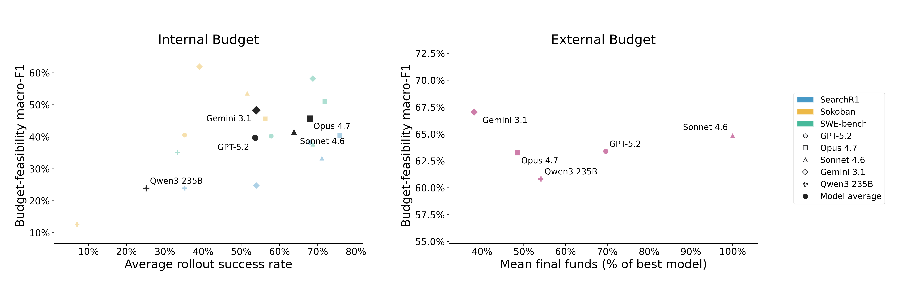

<h1 align="center">BAGEN</h1>
<h3 align="center"><em>Are LLM agents budget-aware?</em></h3>

<p align="center"></p>

<p align="center">
  <strong>BAGEN</strong> studies whether agents can estimate token, time, money, and storage costs mid-completing a task.
</p>
<p align="center">
  We provide rollout logging, budget-estimation benchmarks, experiment trajectories, and SFT/RL for training budget-aware agents.
</p>

<p align="center">
  <a href="./bagen.pdf"></a>
  <a href="https://ragen-ai.github.io/bagen/"></a>
  
  <a href="https://huggingface.co/datasets/MLL-Lab/BAGEN"></a>
</p>

<p align="center">
  
</p>
<p align="center" style="font-size: 15px; max-width: 900px; margin: 0 auto;">
  <em>BAGEN evaluates whether agents can estimate budget cost from partial rollouts, on token and multi-resource settings.</em>
</p>

## News

- **2026.05.27.** We are excited to release **BAGEN**!

## About

BAGEN targets progressive budget estimation in long-horizon agent rollouts. At
each prefix of an interaction, a model is asked to estimate whether the agent can
still finish within the remaining resource budget and, when feasible, how much
budget is needed.

The current public code focuses on four settings:

- **Sokoban:** token-budget estimation over interactive puzzle rollouts.
- **Search-R1:** token-budget estimation for search-agent trajectories.
- **SWE-bench-style coding:** token-budget estimation over coding-agent logs.
- **Warehouse:** multi-resource estimation over time, storage occupancy, and cumulative cost.

BAGEN builds on the RAGEN/verl codebase. The Python package directory is still
named `ragen` to preserve import paths, Hydra configs, wrappers, and training
code compatibility.

## Dataset

The public BAGEN dataset contains the artifacts used to build and evaluate the
budget-estimation benchmark. It is intended for reproducing the reported
offline evaluation results, inspecting agent rollouts, and preparing SFT/GRPO
training data for budget-aware agents.

The hosted dataset is available at:

- Hugging Face: `https://huggingface.co/datasets/MLL-Lab/BAGEN`

The dataset is organized into two main directories:

- `origin/`: original rollout artifacts from Sokoban, Search-R1,
  SWE-bench-style coding, and anonymized Warehouse-style tasks. These files are
  the source trajectories, dialogues, and logs used to construct prefix
  budget-estimation prompts.
- `estimation/`: derived offline budget-estimation files, including prompt/target
  pairs, evaluator outputs, model predictions, and aggregate records used for
  benchmark scoring or downstream budget-RL data preparation.

On the project machine, the current staging copy is:

- `/u/ylin30/database/origin`
- `/u/ylin30/database/estimation`

The Hugging Face repository also includes `manifest.jsonl`, a file index with
paths, sizes, and direct download URLs for the uploaded artifacts. Local
environment/training datasets used by the codebase live under `data/`, but large
benchmark artifacts should remain outside Git and be downloaded from the
dataset repository when needed.

## Method

The benchmark is organized as a two-pass pipeline:

1. **Original rollout collection.** Run a task model in an environment and save
   both rollout artifacts and dialogue JSON logs.
2. **Offline budget estimation.** Replay rollout prefixes and ask an evaluator
   model to output a remaining-budget interval or `impossible`.
3. **Budget-RL training.** Convert estimation data into SFT/GRPO datasets and
   train a budget estimator with local-model rollout support.

## Benchmark Summary

<p align="center">
  
</p>
<p align="center" style="font-size: 15px; max-width: 900px; margin: 0 auto;">
  <em>Budget-estimation results across external and internal benchmarks.</em>
</p>

## Getting Started

```bash
git clone --recurse-submodules <repo-url>
cd BAGEN
conda create -n bagen python=3.12 -y
conda activate bagen
bash scripts/setup_bagen.sh
export PYTHONPATH="$PWD:$PWD/verl"
```

For Search-R1 retrieval experiments, download or build the search index:

```bash
python scripts/download_search_index.py
```

## API Keys

API-based evaluation uses the provider selected by `MODEL_NAME`. Export only the
key required for the model you run:

```bash
export OPENAI_API_KEY=...
export ANTHROPIC_API_KEY=...
export OPENROUTER_API_KEY=...
export GEMINI_API_KEY=...
export TOGETHER_API_KEY=...
export DEEPSEEK_API_KEY=...
```

Set `DRY_RUN=1` to build prompts and validate inputs without calling an API.

## Run Budget Estimation

**Sokoban**

```bash
INPUT_JSON="$PWD/results/estimation/sokoban-origin-gpt5.2-instant-128-main/sokoban_api_eval_estimation_eval_estimation_dialogues.json" \
MODEL_NAME=qwen/qwen3-235b-a22b-2507 \
MAX_CONTEXT_WINDOW_TOKENS=2500 \
bash scripts/evaluation-scripts/eval/sokoban.sh
```

**Search-R1**

```bash
INPUT_JSON="$PWD/results/estimation/searchr1-origin-gpt5.2-instant-128-main/search_r1_api_eval_estimation_eval_estimation_dialogues.json" \
MODEL_NAME=qwen/qwen3-235b-a22b-2507 \
MAX_CONTEXT_WINDOW_TOKENS=3500 \
bash scripts/evaluation-scripts/eval/searchr1.sh
```

**SWE-bench-style coding**

```bash
INPUT_SOURCE=/path/to/swebench-origin-rollouts \
MODEL_NAME=Claude-Opus-4.7-low-thinking \
bash scripts/evaluation-scripts/eval/swebench.sh
```

**Warehouse**

```bash
INPUT_SOURCE=/path/to/warehouse_rollouts.json \
MODEL_NAME=qwen/qwen3-235b-a22b-2507 \
BUDGET_PRESET=half-reachable \
bash scripts/evaluation-scripts/eval/warehouse.sh
```

Each eval script writes:

- `OUTPUT_JSON`: predictions, ground truth, API usage, and aggregate metrics
- `TEMP_JSON`: prompt/target pairs for inspection

Smoke-test an eval path without API calls:

```bash
DRY_RUN=1 MAX_SAMPLES=5 INPUT_JSON=/path/to/dialogues.json \
bash scripts/evaluation-scripts/eval/sokoban.sh
```

## Budget-RL Training

The SFT/GRPO pipeline for training a budget estimator lives under
`scripts/budget-rl`.

```bash
DRY_RUN=1 bash scripts/budget-rl/run_budget_rl_pipeline.sh prepare,sft,rl
```

For a real run, remove `DRY_RUN=1` and set the model, data, GPU, and checkpoint
variables:

```bash
TASK=sokoban \
ROLLOUT_MODEL=Qwen/Qwen3-8B \
LEARNER_MODEL=Qwen/Qwen2.5-7B-Instruct \
NUM_TRAJECTORIES=128 \
NGPUS=8 \
bash scripts/budget-rl/run_budget_rl_pipeline.sh all
```

## Public Release Notes

Do not commit local experiment outputs or private manuscript drafts. The release
expects these to stay outside Git:

- `results/`, `logs/`, `wandb/`, `outputs/`, `model_saving/`
- `data/`, `search_data/`, downloaded search indices, and raw Warehouse data
- local PDFs such as `Budget_NeurIPS_2026*.pdf`
- API keys, `.env` files, and machine-specific absolute paths

The Warehouse data used by the paper should be released only in anonymized form.
Do not add raw enterprise records to this repository.

## Citation

If you find this work useful, please cite:

```bibtex
@misc{lin2026bagen,
  title={BAGEN: Are LLM Agents Budget-Aware?},
  author={Yuxiang Lin and Zihan Wang and Mengyang Liu and Yuxuan Shan and Longju Bai and Junyao Zhang and Xing Jin and Boshan Chen and Jinyan Su and Xingyao Wang and Jiaxin Pei and Manling Li},
  year={2026},
  note={Preprint},
}
```

## License

MIT
